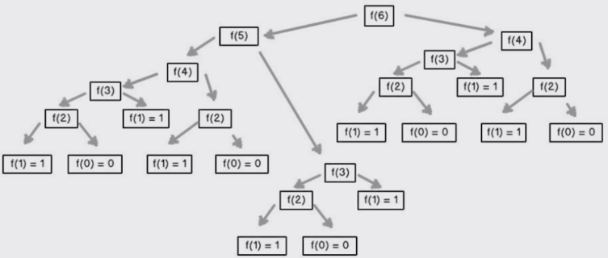
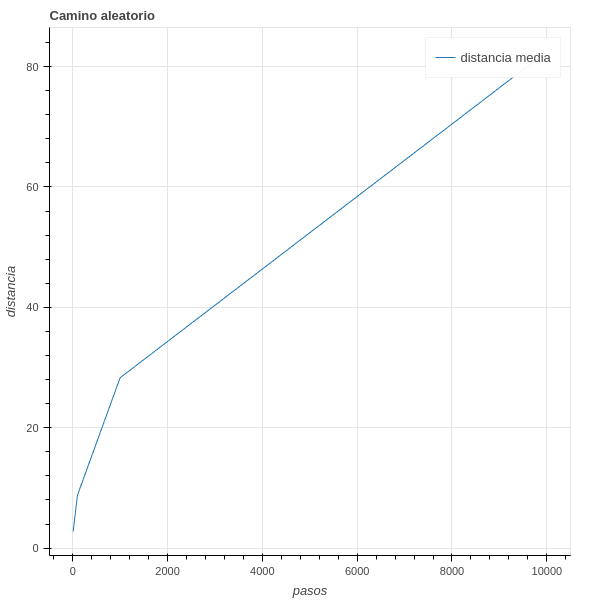
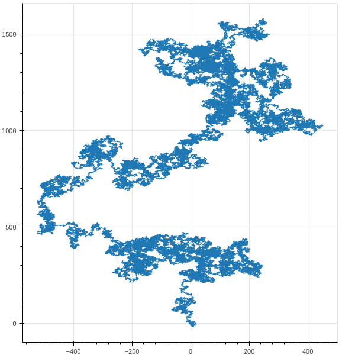

# Curso de Estadística Computacional con Python


# Tabla de Contenido
- [Programación dinámica](#programación-dinámica)
    - [Optimzación Fibonnaci](#optimización-de-fibonacci)
        - [Optimización Especial](#optimización-especial)
        - [Código](#código)
    - [Caminos Aleatorios](#caminos-aleatorios)
        - [Resultados](#resultado-de-la-simulacion)
        - [Código](#códigos-del-borracho)
        - [Aporte solo pasos del borracho](#código-para-solo-observar-los-pasos-del-borracho)
- [Procesos Estocásticos](#procesos-estocásticos)
- [Monte Carlos](#monte-carlos)
- [Muestreo e Intervalos de Confianza](#muestro-e-intervalos-de-confianza)
- [Datos experimentales](#datos-experimentales)
- [Conclusiones](#conclusiones)


# Programación dinámica

**Programación dinámica:** Se escogió para esconder a patrocinadores gubernamentales el hecho que en realidad estaba haciendo Matemáticas. La frase Programación Dinámica es algo que ningún congresista puede oponerse. **Richard Bellman**

**Programación dinámica:**
- Subsestructura Óptima: Una solución global óptima se puede encontrar al combinar soluciones óptimas de subproblemas locales.
- Problemas empalmados: Una solución óptima que involucra resolver el mismo problema en varias ocasiones.

**Memoization:**
- La memorización es una técnica para guardar cómputos previos y evitar realizarlos nuevamente.
- Normalmente se utiliza un diccionario, donde las consultas se pueden hacer en O(1).
- Intercambia tiempo por espacio.

> Ventaja de consulta de los Sets y Dict de O(1).

## Optimización de Fibonacci

$$F_n = F_{n-1} + F_{n-2} \quad \forall~n > 2$$



Pero el algoritmo recursivo es ineficiente, debido a que crece de manera exponencial el tiempo de cómputo.

> **Hint:** Para medir tiempo de ejecución desde consola (Mi sistema operativo es Pop!_OS):
>```shell
>time python src/programacion_dinamica-1.py
>```
Aprovechando el tiempo de consulta de los diccionarios optimizamos el tiempo de ejecución para calcular un número $n$ de Fibonacci.

>**Hint:** Para aumentar el tamaño de recursión y no sea un límite, añadimos la siguiente línea de código:
>```python
>sys.setrecursionlimit(10002)
>```

> Sitio Web para observar como funciona ambos algoritmos: [Dynamic Programming (Fibonacci)](https://www.cs.usfca.edu/~galles/visualization/DPFib.html)

### Optimización Especial
```python
from functools import lru_cache

@lru_cache(maxsize=None)
def fib(n):
    if n < 2:
        return n
    return fib(n-1) + fib(n-2)
```
### Código 
[**File**: programacion_dinamica-1.py](src/programacion_dinamica-1.py)
```python
import sys
from functools import lru_cache

def fibonacci_recursivo(n):
    if n == 0 or n == 1:
        return 1

    return fibonacci_recursivo(n - 1) + fibonacci_recursivo(n - 2)


def fibonacci_dinamico(n, memo = {}):
    if n == 0 or n == 1:
        return 1

    try:
        return memo[n]
    except KeyError:
        # Si no esta en el diccionario, lo calculamos y lo guardamos
        resultado = fibonacci_dinamico(n - 1, memo) + fibonacci_dinamico(n - 2, memo)
        memo[n] = resultado

        return resultado

@lru_cache(maxsize=None)
def fib(n):
    if n < 2:
        return n
    return fib(n-1) + fib(n-2)

if __name__ == '__main__':
    sys.setrecursionlimit(10002)
    n = int(input('Escoge un numero: '))
    # resultado = fibonacci_recursivo(n)
    resultado = fib(n)
    # resultado = fibonacci_dinamico(n)
    print(resultado)
```

## Caminos Aleatorios

> Caminos Aleatorios:
> - Es un tipo de simulación que elige aleatoriamente una decisión dentro de un conjunto de decisiones válidas.
> - Se utiliza en muchos campos del conocimiento cuando los sistemas no son deterministas e incluyen elementos de aleatoriedad.

La idea viene dado por el movimiento browniano, este es el movimiento aleatorio de partículas suspendidas en un fluido (líquido o gas) debido a colisiones con moléculas del medio. Este fenómeno fue observado por Robert Brown en 1827 y es un ejemplo de un proceso estocástico

### Entendiendo la aleatoriedad con Python

Se dividio en 3 clases:
- ¿Qué es un borracho? *Borracho*
- ¿Dónde se mueve este borracho? *Campo*
- Concepto abstracto a tráves de un objeto: *Coordenada*.

**Borracho**, toma cambios en alguna de las coordenadas de forma aleatoria. Cada posible paso tiene igual probabilidad de ocurrencia.
```python
import random

class Borracho:

    def __init__(self, nombre):
        self.nombre = nombre


class BorrachoTradicional(Borracho):

    def __init__(self, nombre):
        super().__init__(nombre)

    def camina(self):
        # Igual probabilidad seleccionar cualquier paso
        return random.choice([(0, 1), (0, -1), (1, 0), (-1, 0)])

```


**Campo**, muestra (gráfica) los pasos del borracho y limita el área donde se mueve.
```python
class Campo:

    def __init__(self):
        self.coordenadas_de_borrachos = {}

    def anadir_borracho(self, borracho, coordenada):
        """
        Add Borracho al campo
        """
        self.coordenadas_de_borrachos[borracho] = coordenada

    def mover_borracho(self, borracho):
        """
        Mueve el borracho modificando sus coordenadas
        """
        # Genera un paso
        delta_x, delta_y = borracho.camina()
        # Obtiene las coordenadas del borracho
        coordenada_actual = self.coordenadas_de_borrachos[borracho]
        # Crea una nueva coordena
        nueva_coordenada = coordenada_actual.mover(delta_x, delta_y)
        # Modifica la coordena
        self.coordenadas_de_borrachos[borracho] = nueva_coordenada

    def obtener_coordenada(self, borracho):
        """
        Get Coordenada
        """
        return self.coordenadas_de_borrachos[borracho]
    
```

**Coordenada**, crea el marco de referencia para el *Borracho* y el *Campo*. Nos permite también calcular la distancia entre una coordena y otra.
```python

class Coordenada:

    def __init__(self, x, y):
        self.x = x
        self.y = y

    def mover(self, delta_x, delta_y):
        """
        Retorna una nueva Coordenada
        """
        return Coordenada(self.x + delta_x, self.y + delta_y)

    def distancia(self, otra_coordenada):
        """
        Calcula la distancia Euclidiana
        """
        delta_x = self.x - otra_coordenada.x 
        delta_y = self.y - otra_coordenada.y 

        return (delta_x**2 + delta_y**2)**0.5
```

> La simulación genera $n$ cantidad de pasos del borracho. Siempre que hacemos aleatoriedad ejecutamos $m$ simulaciones para $n$ pasos. Para luego obtener las estadísticas necesarias para proponer los resultados de esas observaciones.

```python
# Librerias a emplear
from borracho import BorrachoTradicional
from campo import Campo 
from coordenada import Coordenada 

# Para graficar
from bokeh.plotting import figure, show

def caminata(campo, borracho, pasos):
    # Coordinate init
    inicio = campo.obtener_coordenada(borracho)

    for _ in range(pasos):
        # Move borracho
        campo.mover_borracho(borracho)

    # Return distance between origin and end
    return inicio.distancia(campo.obtener_coordenada(borracho))


def simular_caminata(pasos, numero_de_intentos, tipo_de_borracho):
    
    # Add Borracho
    borracho = tipo_de_borracho(nombre='Rigo')
    # Crear origen
    origen = Coordenada(0, 0)
    # Save distance
    distancias = []

    for _ in range(numero_de_intentos):
        # Creo el campo
        campo = Campo()
        # Ubico el borracho
        campo.anadir_borracho(borracho, origen)
        # Caminar y devuelve la distancia caminda desde el origen
        simulacion_caminata = caminata(campo, borracho, pasos)
        # Save
        distancias.append(round(simulacion_caminata, 1))

    return distancias

def graficar(x, y):
    """
    Plot n vs Distancia media
    """
    grafica = figure(title='Camino aleatorio', x_axis_label='pasos', y_axis_label='distancia')
    grafica.line(x, y, legend_label='distancia media')

    show(grafica)

def main(distancias_de_caminata, numero_de_intentos, tipo_de_borracho):

    # Save mean distance
    distancias_media_por_caminata = []

    for pasos in distancias_de_caminata:
        distancias = simular_caminata(pasos, numero_de_intentos, tipo_de_borracho)
        # Media
        distancia_media = round(sum(distancias) / len(distancias), 4)
        # Maxima
        distancia_maxima = max(distancias)
        # Minima
        distancia_minima = min(distancias)
        # Save
        distancias_media_por_caminata.append(distancia_media)
        print(f'{tipo_de_borracho.__name__} caminata aleatoria de {pasos} pasos')
        print(f'Media = {distancia_media}')
        print(f'Max = {distancia_maxima}')
        print(f'Min = {distancia_minima}')

    graficar(distancias_de_caminata, distancias_media_por_caminata)

if __name__ == '__main__':

    # Number of steps -> n
    distancias_de_caminata = [10, 100, 1000, 10000]
    # Number of Simulations -> m
    numero_de_intentos = 100

    main(distancias_de_caminata, numero_de_intentos, BorrachoTradicional)
```
### Resultado de la Simulacion



### Códigos del Borracho

|Name File | Link |
|-|-|
|Borracho| [Borracho](src/borracho.py) |
|Campo| [Campo](src/campo.py) |
|Coordenadas | [Coordenadas](src/coordenada.py)|
|Simulación | [Simulation](src/camino_aleatorio.py)|

### Código para solo observar los pasos del borracho

> Nota: Aportado por un estudiante de la comunidad de Platzi. (Angel Armando Martínez Blanco)

```python
from borracho import BorrachoTradicional
from coordenada import Coordenada
from campo import Campo

from bokeh.plotting import figure, show

def main(distancia, inicio, borracho):
    campo = Campo()
    campo.anadir_borracho(borracho, inicio) #poner un borracho en origen
    ejecutar_caminata(campo, borracho, distancia)

def ejecutar_caminata(campo, borracho, distancia):
    x_arreglo = []
    y_arreglo = []
    x_arreglo.append(campo.obtener_coordenada(borracho).x)
    y_arreglo.append(campo.obtener_coordenada(borracho).y)
    for _ in range(distancia):
        campo.mover_borracho(borracho) #se actualiza las coordenadas del borracho
        x_arreglo.append(campo.obtener_coordenada(borracho).x)
        y_arreglo.append(campo.obtener_coordenada(borracho).y)

    graficar(x_arreglo, y_arreglo)

def graficar(x, y):
    figura = figure()
    figura.line(x, y)
    show(figura)

if __name__ == '__main__':
    distancia = 1000000
    inicio = Coordenada(0,0)
    borracho = BorrachoTradicional('Rigo')
    main(distancia, inicio, borracho)
```


# Procesos Estocásticos

# Monte Carlos

# Muestro e Intervalos de Confianza

# Datos Experimentales

# Conclusiones
